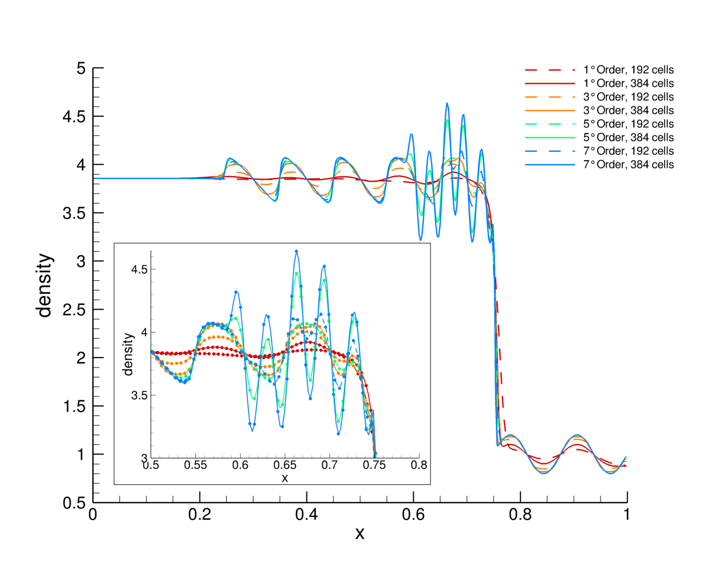

<a name="top"></a>

# Shu-Osher shock tube problem

[]()
[]()
[]()
[]()

Regression results on Shu-Osher shock tube problem.

### Obtaining the code

From you preferred terminal clone this repository:

```shell
git clone  https://github.com/szaghi/Shu-Osher-shock-tube-problem
```

#### Code documentation

The code API is available at the project [GitHub Pages](http://szaghi.github.io/Shu-Osher-shock-tube-problem/index.html).

### Compiling the code

Use [FoBiS](https://github.com/szaghi/FoBiS). Inside the project run, type:

```shell
FoBiS.py build
```

### Using the code

From you preferred terminal type:

```shell
./build/euler-1D --Ni #cells_number --order #order_of_accuracy
```

The order of accuracy must be chosen in [1, 3, 5, 7].

### Regression test results

The results are contained into `results` sub-directory inside the root of project.

Using a coarse grid of 192 uniform cells and a fine one of 384 uniform cells, the results are summarized into the following figure.


