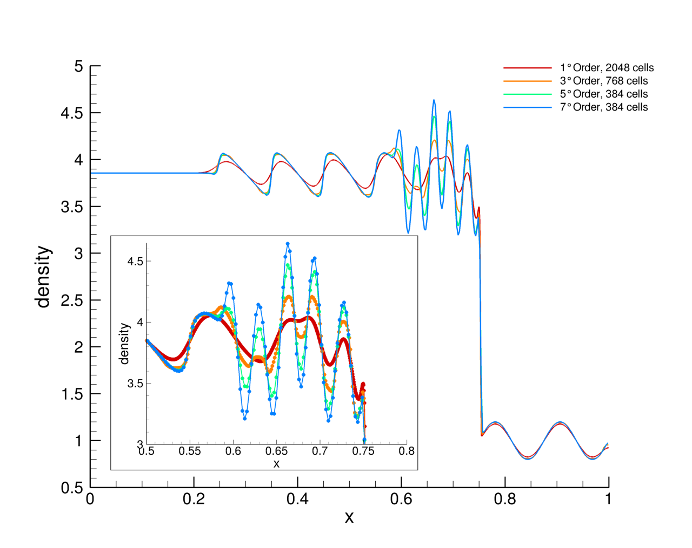

### High Order/Low Grids Resolution vs Low Order/High Grids Resolution

To achieve a certain (satisfactory) level of accuracy two approaches are viable:

+ increase the order of accuracy of the mathematical/numerical methods used;
+ increase the numerical grids resolution.

It is not obvious to recognize the best approach.

Here we compare the computational cost related to the solution of the Shu-Osher shock tube problem.

For this test, similar accuracy can be obtained by means of a 1st order accurate method using 2048 finite volumes and by means of a 7th/5th order accurate method using only 384 finite volumes or 3rd order accurate method using 768 cells.  As we can see from the following figure, accuracy of these solutions are *comparable*, indeed the high order one with the lowest resolution is still the most accurate.

Two *kinds* of costs should be firstly considered:

+ the cost of a single time step;
+ the overall cost for completing the simulation.

#### cost of single time step

This cost essentially depends on:

+ grid resolution: higher is the resolution, higher is the cost, obviously;
+ code complexity: higher is the order of accuracy of the method, higher is its complexity, higher is the cost.

As a consequence, the two approach can behave similarly: with high order/low resolution approach one can obtain similar accuracy and similar cost of low order/high resolution.

#### overall simulation cost

This cost is the sum of the cost of each time step. As a consequence, one could assume that again the two approach can behave similarly. However, for time accurate simulation (where the time step depends on CFL like condition) the high order/low resolution has the pros to allow larger time steps, thus resulting in a **lower** number time steps computed, i.e. a lower overall simulation cost. Consequently, fixed the single time step cost, the high order/low resolution approach should be preferable with respect the low order/high resolution one.

### Results

For the Shu-Osher test, using the code here provided, we obtain

|               | 384 cells, 7th order | 384 cells, 5th order | 768 cells, 3rd order | 2048 cells, 1st order |
|---------------|----------------------|----------------------|----------------------|-----------------------|
| CPU time      | 0m14.163s            | 0m8.407s             | 0m18.857s            | 0m22.383s             |
| SLOC executed | 196                  | 196                  | 196                  | 162                   |
| RP solved     | 1250480              | 1245090              | 4957743              | 34939548              |

where *SLOC* is the source line of code executed and *RP* are the number of Riemann Problem solved. Considering that 5th and 7th order solutions have really comparable accuracy, the 5th order solution could be the most convenient, it being about 40% faster than the 7th order solution.

The benchmarks shown in this section have been done on a \emph{dual Intel(R) Xeon(R) CPU X5650} exacores workstation for a total of 12 physical cores, coupled with 24GB of RAM. The results refers to the serial compiled code without any optimizations (in order to compare only the code complexity/grid resolution effects).

Detailed coverage metrics can be found below for both the two approaches:

+ [Ni 384, 7th order](https://github.com/szaghi/Shu-Osher-shock-tube-problem/tree/master/profiling/Ni_384-Order_7/type_euler-1D.f90.gcov.md)
+ [Ni 384, 5th order](https://github.com/szaghi/Shu-Osher-shock-tube-problem/tree/master/profiling/Ni_384-Order_5/type_euler-1D.f90.gcov.md)
+ [Ni 768, 3rd order](https://github.com/szaghi/Shu-Osher-shock-tube-problem/tree/master/profiling/Ni_768-Order_3/type_euler-1D.f90.gcov.md)
+ [Ni 2048, 1st order](https://github.com/szaghi/Shu-Osher-shock-tube-problem/tree/master/profiling/Ni_2048-Order_1/type_euler-1D.f90.gcov.md)
